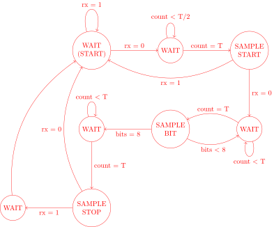
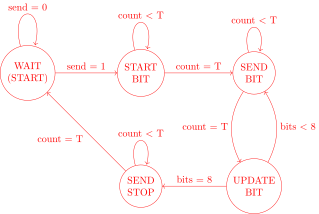
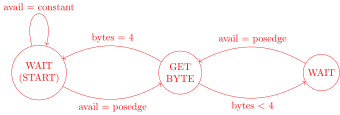
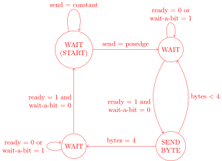
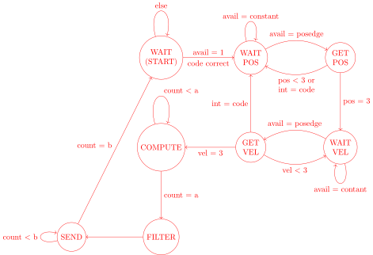
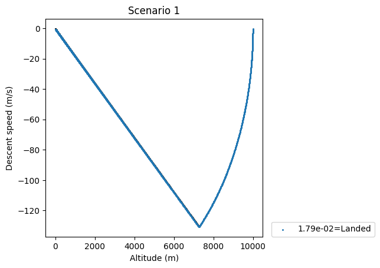
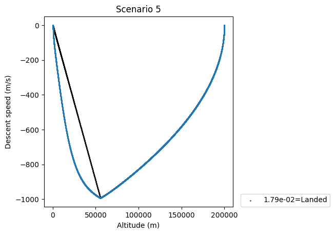
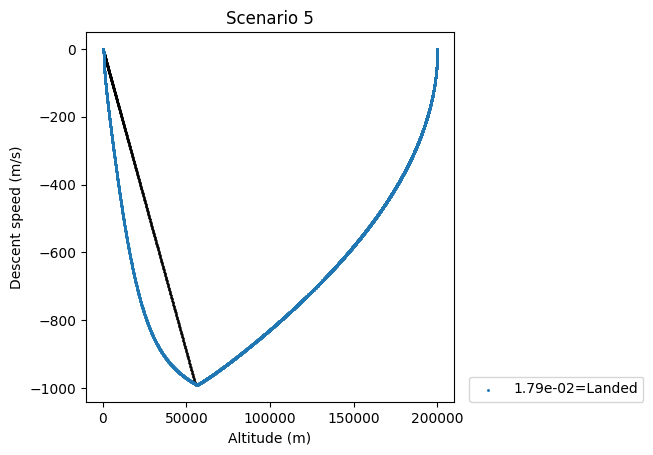

# A hardware lander proportional controller from scratch
* [Abstract](#abstract)
* [Hardware](#hardware)
    * [UART](#uart)
    * [```int``` exchanger](#int-exchanger)
    * [Flight controller](#flight-controller)
* [Testing](#testing)
* [Packets library](#packets-library)
* [Performance](#performance)
* [Outlook](#outlook)
* [Acknowledgements](#acknowledgements)

## Abstract

The [IA Mars Lander](https://teaching.eng.cam.ac.uk/content/mars-lander-exercise) project, part of the Cambridge University Engineering course, challenges the student to write a proportional controller to land a simulated rover on Mars in C++. As an extension to that, I have designed a _hardware_ controller, written in Verilog. This was physically implemented on an [FPGA](https://wiki.sipeed.com/hardware/en/tang/tang-nano-20k/nano-20k.html), and validated by actually landing the rover through USB communication. Naturally, on top of the controller proper, this also involved writing an UART for communication with the simulation and a C++ library to handle sending and receiving data neatly&mdash;all of which is described here, along with bits and pieces of my design journey.

## Hardware

The actual hardware description for all modules discussed can be found in the `../hardware/` folder. All modules feature a `rst` input in order to be reset nicely with the FPGA board, which is not discussed. 

The flight (or landing) controller communicates with the computer through a Universal Asynchronous Receiver-Transmitter (UART). The bytes received by (or to be sent through) the UART are packaged into 32-bit "integers", or `int`s (actually fixed-point numbers). These are processed by the flight controller proper, which performs a proportional control computation very similar to that of Assignment 5[^expla]. The inner workings of these modules are explained in this section.

### UART

There is not a lot of room for creativity in designing a UART, since the [protocol](https://www.analog.com/en/resources/analog-dialogue/articles/uart-a-hardware-communication-protocol.html) is quite tightly specified. As a short summary, the UART protocol uses two data channels (in practice, wires), called `rx` and `tx`, which `r`eceive and `t`ransmit data according to a rate agreed upon[^agreed-upon] between the devices (naturally the `rx` entry of one device connects to the `tx` port of the other, and vice-versa). Data is sent in packets, described as follows:

1. The data channel is usually held high if no data is being transmitted.
2. A start bit pulls the channel low, signalling a new packet.
3. A variable, agreed-upon number of bits follow. In my case, I implemented the standard byte.
4. A possible agreed-upon parity bit follows. I did not implement that.
5. A stop bit ends the transmission, holding the channel high. 

The particular FPGA development board I used does have a UART device, but it is for interfacing between the FPGA _chip_ and the board's USB port[^wsl], meaning I still needed to implement another UART for the FPGA chip. It is only natural to implement this UART with a state machine, one for the `rx` module and another for the `tx` module. 

Although my UART implementation is not perfect, it was fit the present purposes neatly. Since this was my very first time using (and learning!) Verilog, the state machines are rather long, and perhaps the implementations are not formally correct. But after a lengthy debugging process, they work sufficiently well (which, given my painful experience using the UART of Arduinos and the like, is very surprising). 

#### `rx` module

The state machine for the `rx` module is as follows[^prop-pict]:



The logic is very simple: it waits until the `rx` input is pulled down, and then samples in the precise middle of every single bit, as ensured by the counter `count` which translates the clock to the baud rate (`T` is the duration of a bit). If the start bit or stop bit is sampled to an incorrect value, the packet is assumed to be corrupted (or sampled at the wrong time) and the machine returns to the initial state (labelled `WAIT (START)`). The last `WAIT` before returning to the initial state initially waited for a period of `T/2` in order to reach the end of the stop bit, but it was found that this incurred in a lot of bugs if many packets were being sent; so now it simply redirects to the initial state without waiting. 

Specifying the module interface, there are the signals `avail` and `data`. `avail` is set to high when there is new data to be read from the module, which can be accessed as an 8-wide register called `data`. 

#### `tx` module

The state machine for the `tx` module is as follows:



The `tx` module is controlled by a `send` signal, driven by whoever is using the module, which starts the transmission of the data placed in `data`. It then sends each bit of the packet for the specified time `T`. The `UPDATE BIT` state is responsible for changing the "pointer" of sorts that is sweeping the data to be sent, called `bits`. 

### `int` exchanger

The bytes tranferred by the UART encode too little data to be be of use on their own, so that they must be packaged into a larger set if they are to represent lander data. Furthermore, the coordinates and velocity components of the lander can be negative, so that whichever data format used must handle negative numbers. I have settled on a 32-bit signed fixed-point representation for each coordinate/component, which avoids the hassle of a floating point unit while also having enough precision to control the lander. Each of these `int`s (so called because of the size of `int`s in x86 machines) has the following structure:

|Bit index|31|30|29|$\cdots$|8|.7|$\cdots$|1|0|
|----------|--|--|--|--------|-|-|--------|-|-|
|Bit meaning|SB|I22|I21|$\cdots$|I0|.F7|$\cdots$|F1|F0|

where `SB` denotes the sign bit (following 2's complement), `I*` denotes "integer" bits and `F*` denotes "fractional" bits. Thus, one can imagine the flight controller measures everything in integer units of $(1/256)$-meters, which gives a precision of about 4 millimeters. 

This works because $\lfloor\log_2(3586000\cdot256) + 1\rfloor = 30$, which, with the sign bit, means that representing $-3586000$ this way takes 31 bits. Since that is the maximum position coordinate of the lander in scenario 5, this representation manages to just about fit the numbers of the simulator.[^number]

Thus, I designed another two modules for packaging and transferring `ints` through the UART, `int_receiver` and `int_sender`. They do what you think they do.

#### `int_receiver` module

The state machine for this module is:



The `avail` signal in the diagram is that of the `rx` module inside it, and `bytes` indexes the bytes which make up an `int`. Notice that new bytes are detected on rising edges of `avail`, otherwise the receiver would potentially read the same byte on repeat. This was accomplished through a register storing the previous `avail` (that is, a single `always@(posedge clk)` still governed the module, to avoid timing errors).

#### `int_sender` module

The state machine for this module is:



The sender waits for whoever is using it to set `send = 1` in order to start sending the `int` (notice that a rising edge is needed in order not to repeat data). Before sending each byte or accepting a new `int`, the sender waits for a minimum of a clock cycle (controlled by `wait-a-bit`), or until the `tx` module signals it is `ready`. (The clock delay is to ensure the `tx` module actually received the next byte).

### Flight controller

The state machine for the flight controller is as follows:



The simulator sends all position coordinates and velocity components of the lander&mdash;that's what the `pos` and `vel` registers count. I also decided to send the `int` $(10)_2^{\times 16}$ as a start code, signalling the beginning of another (poisition, velocity) set so that the controller can reorient itself in case the communication goes wrong.[^choice] 

The `COMPUTE` state holds the most interesting design choices. By "computing" the proportional control output, I really mean computing the _unbounded_ output, without the enforced plateaus of the handout. (The bounds are enforced by the `FILTER` state). The math I used in Assignment 5 (not shared) can be summarised as
$$P_{\mathrm{out}} = -(0.5 + K_h\cdot h + v_r),$$
where $h$ is the altitude of the lander and $v_r$ is its descent speed, negative if down. 

Crucially, $K_h$ was a constant chosen to be $1/60$. In order to implement it without division (which is very convenient), I could naively store the value of $1/60$ (in the usual representation) in a register, and then multiply $h$ by it. However, in my representation, $1/60$ reads to 4 (since $\lfloor256/60\rfloor = 4$), but $256/60 \approx 4.27$; that is just an intolerably low precision, given the tight fuel availability. A better strategy is to interpret $1/60 = (1/4)\cdot(1/15)$, since $1/4$ can be computed exactly as a right shift[^overflow] and $256/15 = 17.07$, which gives much better precision. But while I was at it, why not choose a better constant?

I ended up choosing $1/56$ to be my $K_h$, since $1/56 = (1/8)\cdot (1/7)$, which gives good accuracy with less fuel consumption[^truth]. Thus, I encoded it by a shift right of 3 bits, then multiplication by $\lfloor 256/7\rfloor = 36$, then a right shift of 8 bits. (Obviously I could reduce it to multiplication by 9 then a right shift of 6 bits, but this only reduces maintainability since overflow is guaranteed not to happen). 

It's time to address the elephant in the room: how to compute $h$ and $v_r$ in the first place? In general, they require nasty squares, (inverse) roots, and inner products, which are conductive to overflows and more complex state machines. But this can be completely avoided by one simple trick: assuming the rover is falling straight along one of the cartesian axis. This makes computing the altitude a simple matter of summing absolute coordinates then subtracting Mars's radius, which is a fixed value. Computing radial velocity also becomes just summing velocity components. All of this comes at the cost of reducing applicability, but I think that is ok for two reasons:

1. The choice of axis is, realistically, arbitrary. One can always choose the lander to be falling along an axis. The fact that this might not be the case is a peculiarity of the precise simulation used.
2. The alternatives are too complicated or self-defeating. One could use complex 32 bit floating point, or increase the width of the representation to 64 bits; but this would increase the rate of transmission errors too. (Not to mention require the implementation of an algorithm for finding inverse square roots). Or one could pre-compute the height and radial velocity in the lander&mdash;but if the lander can do this, surely it can compute its own proportional control. 

Thus, I think it is a sensible design choice.

Finally, the constants `a` and `b` represent waiting times. The first is to ensure that there is enough time for the result of the computation, however it is synthesized, to reach the desired register. Since the latency of the controller is dominated by the UART transfers anyway, I set `a = 100` generous clock cycles. For `b`, I needed to ensure the data and the `send` signal are held by a sufficiently long time, like the `b = 3` clock cycles I chose.

## Testing

Unfortunately, my testing procedure was too chaotic to be neatly summarised in a session. The leftover files resulting from it can be read in the ``../Assignment5.5`` folder (except the lander code, which cannot be included).

I tested each hardware level incrementally. In order to test either the UART or `int` exchange modules, I:
1. created a top module which used them to flood the serial port with a sequence of characters;
2. built another module which used them to echo characters typed into the serial port through Putty. I also tested automated communication through the files in the `../../usb_test/` folder.
3. Finally, I hooked these echo modules to a version of the lander simulator which sent each `int` and listened back before controlling the lander as usual. 

This ensured I was fairly confident these modules worked in practice. If any error appeared in these tests that proved too difficult to trace, I would write a verilog testbench and monitor registers and wires with `$display` statements, dumped into log files.

In order to test the flight controller, I first hooked it to the simulator, which failed. Then I developed a Verilog testbench which acted as the simulator sending a constant stream of the same data point, as if the lander was stuck in some frame descending into Mars. Even this testbench proved too complex to be fixed with `$display` statements, so that I used a waveform viewer to diagnose the problems. This revealed that there was a problem in the `int_sender` and `rx_module` designs, which I managed to fix.

I have learned from this experience that:
* it is always worth it to write a testbench
* waveform viewers are usually better than `$display` statements
* generative AI is terrible at diagnosing hardware (it would always insist my implementation was cumbersome, even if technically correct, probably because it doesn't look like its training data).

All simulations were done through Verilator, and waveform viewing through GTKWave.

## Packets library

In order to streamline the data transfers between the simulator and the FPGA board, I wrote a tiny class in the `packets.h` library, the members of which are explained below:
```cpp
class packet{
    private:
        double repr_double; //number stored in packet, written as double
        uint8_t* repr_fixed32; //same but written in fixed point
    public:
        packet(double num);
        packet(uint8_t* num);
        packet(char* num); //overloaded constructors. Char* is the output of some serial reads
        packet(); //default constructor if to initialise an array
        static uint8_t* convert(double num);
        static double convert(uint8_t* num); //methods for conversion. They strip away the 256 factor
        uint8_t* fixed();
        double doub(); //getters
        void send(); //send the packet through serial
        static double receive(); //receive packet (thus static)
        //this waits at most 50ms for the packet. otherwise it gives up and uses a dummy value.
};
```
Notice that it does no meaningful computation at all. If the sensors and throttle system of the lander worked natively with my fixed point representation, this library would be almost useless.

The library includes another one, `serial.h`, which can be found in the `../third_party` folder. It was not written by me (found on GitHub), but does much of the behind-the-scenes work of data transfer.[^completeness]

## Performance

A video of the controller at work can be found [here](https://drive.google.com/file/d/1X_tWb8DLWtOmhlGwTHKIzjYcx5PyeIfe/view?usp=drivesdk).

In order to have a fair comparison, we establish the baseline with a (boring) software autopilot, with $K_h = 1/56$. This is graphed below[^automated], with 24.7 and 21.8 liters of fuel remaining in the end, respectively:





With the FPGA controller, the lander arrives safely, as can be seen in the below graphs. It arrives with 16.6 and 9.9 liters of fuel remaining, respectively:




Therefore, it is safe to say the FPGA does incur in excessive use of fuel, as could be expected. But it is more efficient than the version with $K_h = 1/60$ I used in Assignment 5 (not shared), so it is still well within acceptable levels.

One could also ask how slow this method is compared to realtime. Considering that the runtime is dominated by the UART transfers, we can compare how long it takes to land in the simulator vs how long it takes in reallife, running the simulator at a large speed (jumps of 10s, in this case). These measurements showed that for Scenario 5, the simulation registers 560s, whereas the stopwatch registered 102s. For Scenario 1, the simulation registers 340s, whereas the stopwatch registered 62s. Therefore, it is reasonable to say that the FPGA board is able to keep up with faster than realtime control, which is desirable. (Without the board, the time of the simulation is small). 

Of course, I must say that these results are not _entirely_ realistic because, in practice, the "universe" is waiting for the controller to give its output at every timestep. But, as shown, it doesn't have to wait for very long, so that the results are believable and indicative of satisfactory performance.

Lastly, anedoctally, I inspected the logs of the runs and only once, across all runs, did the FPGA take more than 50ms to answer to the lander. This is a testament to its trustworthiness.

## Outlook

There is plenty of room for improvement in this controller. The most obvious is that the addition of a floating point unit (or support for larger fixed point numbers) could make it viable for all possible starting positions (that is, as long as they are at the heights of Scenario 1 or Scenario 5), on top of improving fuel efficiency. Formal verification of its design could ensure UART errors and unresponsiveness are kept to a minimum. Furthermore, more sophisticated algorithms, possibly even releasing the parachute, could dramatically decrease fuel consumption.

Even with its limitations, however, I am fairly confident this project can be regarded as a success. More important than the hardware itself, I think the knowledge of designing and testing hardware with Verilog was the main outcome of this experiment. 

## Acknowledgements

I'd like to acknowledge the use of generative AI in helping me debug my design, suggesting changes (including to this report), teaching me parts of Verilog, and helping me write the state machines in LaTeX for this report. However, I do guarantee that not once did AI automatically write anything, and that every small suggestion was carefully analysed before being manually incorporated, and heavily altered in the final text (as in the case for the state machine diagrams). I further acknowledge being greatly helped by [this](https://www.youtube.com/watch?v=uHw7QyL4CM8) video, and using the `.cst` file as provided [here](https://github.com/sipeed/TangNano-20K-example/blob/main/uart/src/top.cst) in order to know how to map my module interface to FPGA pins.  

Lastly, I would like to thank the support from my parents and Jesus in this project.

[^agreed-upon]: I am using the expression to mean that both sides have somehow been informed previously of the data rate, by e.g. hardcoding a constant in the program.
[^prop-pict]: Please note that each circle is a different state, even if they have the same (illustrative) name. There are pictures of the handwritten version I used in the `../photos/` folder, which may have been modified as I debugged the design.
[^number]: Naturally, this introduces several limitations in the applicability of this hardware, which is part of the reason it took me a surprising amount of time to figure out the best representation.
[^choice]: I chose this "striped" 0 and 1 pattern because I expect it to be rare, and also unmistakable for the start and stop bits. Therefore, it will be detected whenever the connection is stable enough. 
[^overflow]: Of course, $256/4 = 64$, so I could encode that shift as a multiplication by $64$ (then a shift right by 8 bits). But since $64\cdot200,000 = 12.8\cdot10^6$, that would cause overflow, which could be catastrophic.
[^truth]: Actually I initially thought having a larger fraction would give more precision, but it turns out the representation of $1/15$ is around four times more precise than $1/7$ (which, in turn, is eight times more precise than $1/56$). However, since $1/56$ consumes less fuel by about an order of magnitude, it is still a better choice. 
[^completeness]: For the sake of completeness, I must say I've also modified the `lander.cpp` file in a trivial way to accomodate this package, and transferred the class `vector3d` to a separate file `vector3d.h` while I experimented with my library.
[^wsl]: As I ran my code in WSL2, I had to route the FPGA board by the following PowerShell commands: `usbipd list`, which listed devices; `usbipd bind --busid 2-1`, to make the device shareable (2-1 was the `BUSID` listed before); and `usbipd attach --wsl --busid 2-1` to make it available from within WSL2. 
[^automated]: This was done with the automated `process.ipynb` file, like in Assignment 5 (not shared).
[^expla]: Unfortunately, due to its license, I cannot share modified versions of the Mars Lander code. The original simulator is included here as `../lander.zip`, along with a `Makefile` to compile it with the libraries used.